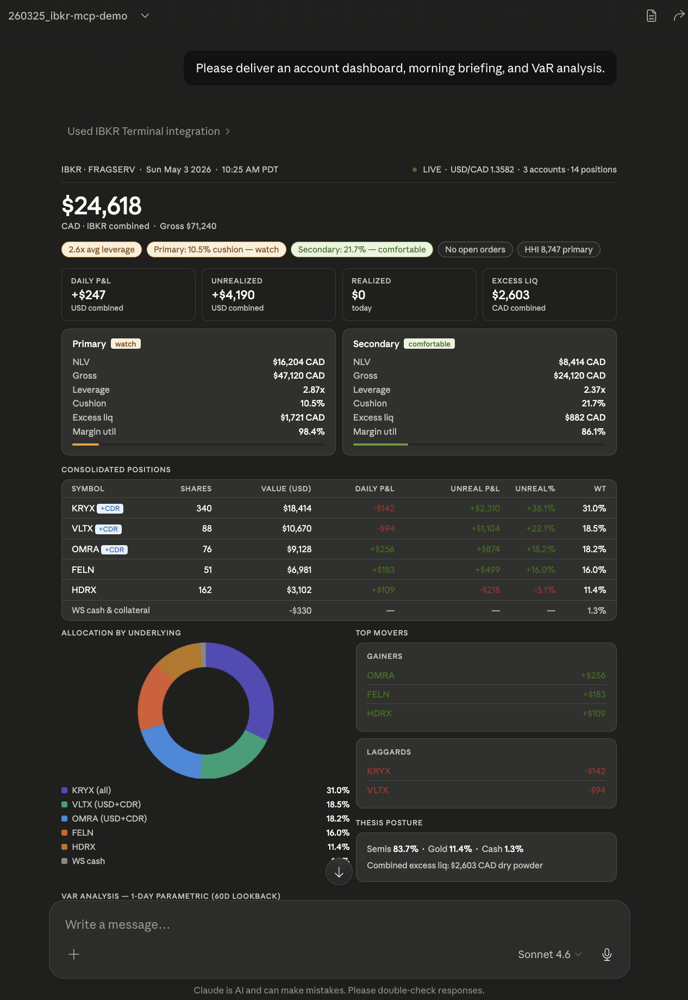

# ibkr-mcp

**An MCP server that turns Interactive Brokers into a question-answering portfolio analyst.**

Ask your portfolio anything in plain English — *"how does my book hold up if rates rip 100bps and the dollar strengthens 5%?"* — and an LLM picks the right tools, chains them, and writes the answer. 41 read-only analytics tools across margin, risk, market data, news, fundamentals, and portfolio intelligence, exposed over the [Model Context Protocol](https://modelcontextprotocol.io).

Tool docstrings are kept tight (1-2 sentences each) so MCP schema overhead at session start stays low for all 41 tools combined.

> This repo is published as a **teardown** — the public-facing server layer of a system I built and run for my own trading. The 41 tool implementations live in a private package and are not included here. The purpose is to show how the pieces fit, what tradeoffs I made, and what shipping against the IBKR API actually looks like. See [Status](#status) below.

<p align="center">

</p>
<p align="center"><em>Account dashboard, morning briefing, and 1-day parametric VaR — all from a single claude.ai prompt against the MCP. Consolidated NLV across two accounts, leverage and margin health bars, full position table with weights, allocation pie, top movers, leaders/laggards, cash posture, and VaR analysis.</em></p>

---

## What it does

Each tool does one composable thing. The model handles orchestration — pull positions, fetch live prices, simulate, decompose, format. *"Morning briefing"* gets you positions, P&L, margin, top movers, thesis conformance, and geopolitical flags in one pass. Follow-up: *"if I trim 30% of my largest position and rotate into the second-largest, what happens to my margin and sector concentration?"* — runs `what_if`, `margin`, `sector_exposure` in sequence, returns a paragraph.

**Portfolio**  Positions, P&L, cost basis, concentration, multi-account consolidated view, dividends.
**Margin**  Real-time margin analysis, what-if simulation, per-symbol efficiency (RegT vs portfolio margin).
**Risk**  Stress testing with custom scenarios (rates, FX, vol, drawdown), correlation matrix, parametric VaR, drawdown tracker against high-water mark.
**Market data**  Quotes, historical bars, intraday, options chains with Greeks, technicals (SMA / RSI / MACD / Bollinger), contract search.
**Intelligence**  Currency exposure decomposition, sector exposure, rebalance planner, portfolio beta, position-level thesis check, geopolitical risk scoring.
**Briefing**  One-prompt daily briefing — positions, P&L, margin, top movers, thesis status, geopolitical flags.
**News**  Live headlines for held names via IB news wires (Dow Jones, Briefing.com), full-article fetch.
**Fundamentals**  Business snapshot, key ratios, analyst consensus estimates and price targets from IB's Reuters feed.
**Scanner**  IB market scanners — top movers, most active, unusual volume — with price/volume/market-cap filters.
**Volatility & borrow**  Realized vs implied vol with IV rank per holding; shortable-share and borrow-availability checks.
**Margin ladder & history**  Per-name forced-liquidation price levels; margin/cushion time-series with creep detection.

All read-only — no order placement, no surface area for an LLM to lose money on its own.

---

## How does this improve financial model responses?

A vanilla LLM has no idea what's in your portfolio, how leveraged you are, what your thesis is, or what the current bid/ask spread is on a given stock. These tools close that gap. A few examples of the actual response shape — sanitized to fictional tickers:

### `ibkr_briefing` — one-shot portfolio snapshot

> *"Give me a morning briefing on my primary account."*

```markdown
# Briefing: U████████
_2026-05-03 17:17:44 UTC_

## Account Health
| Metric              | Value                |
|---------------------|----------------------|
| NLV                 | $24,618.00 CAD       |
| Gross Position Value| $64,124.00 CAD       |
| Leverage            | 2.61x                |
| Cushion             | 10.5% — OK (watch)   |
| Margin Utilization  | 98.4%                |
| Excess Liquidity    | $2,604.00 CAD        |

## Daily P&L
**Daily**: +$312.48 CAD (+0.02% of NLV)
**Unrealized**: +$2,603.00 CAD

## Positions
| Symbol | Shares | Price       | Value           | Daily P&L     | Weight |
|--------|--------|-------------|-----------------|---------------|--------|
| KRYX   |  340   | $54.18 USD  | $18,414 USD     | $-952 (-4.9%) | 38.1%  |
| VLTX   |  86    | $94.32 USD  | $8,112 USD      | $-892 (-1.1%) | 22.3%  |
| OMRA   |  76    | $120.10 USD | $9,128 USD      | +$256 (+2.9%) | 18.9%  |
| FELN   |  51    | $130.40 USD | $6,651 USD      | +$498 (+8.1%) | 14.4%  |
| HDRX   | 162    | $33.04 USD  | $5,353 USD      | +$309 (+6.1%) |  6.4%  |

## Risk Metrics
| Metric          | Value                |
|-----------------|----------------------|
| Top Position    | KRYX (38.1%)         |
| Top 3 Weight    | 79.3%                |
| HHI             | 2,432                |
| Position Count  | 5                    |
```

The vanilla model can't produce any of that — NLV, cushion, weights, daily P&L are all live IBKR state. The tool aggregates `accountSummary`, `portfolio`, the PnL subscription, and connection health into one response so the model can reason about the whole picture without fan-out. Connection status is auto-suppressed when the gateway is connected and data is fresh (< 60s old) — it only appears when something's wrong. Pass `compact=true` to drop Top Movers and Risk Metrics for a shorter morning read.

### `ibkr_thesis_check` — does this news threaten my thesis?

> *"Check this against my thesis: 'AcmeCorp guides next-quarter platform revenue 12% above consensus on hyperscaler custom-silicon orders; cloud volumes ramping into 2H. CFO calls infrastructure spend multi-year structural.'"*

```markdown
# Thesis Check: Platform Buildout
**Time horizon**: 2022-2028
**News item**: AcmeCorp guides next-quarter platform revenue 12% above consensus...

Evaluate each pillar below against the news item. For each: is it INTACT,
THREATENED, or VIOLATED? Provide one-sentence reasoning grounded in the signals.

---

## 1. End-market demand growth
**Description**: Hyperscaler AI infrastructure spend sustaining or growing YoY
**Key indicators**: Quarterly capex guidance, build vs digestion framing
**Intact signal**: Capex guides up or flat, no project cancellations
**Invalidation signal**: Any hyperscaler guides AI infra spend down YoY, or two or more
describe build as pause/digestion on the same earnings call

## 2. Competitive moat (custom silicon)
...
```

The user owns `thesis_config.json` — pillars, descriptions, key indicators, invalidation signals, intact signals. The tool loads the config and presents it alongside the news item for the LLM to evaluate semantically. Keyword matching can't handle conditional invalidation conditions ("two hyperscalers on the same call") — language understanding can.

### `ibkr_quote` — live multi-symbol comparison

> *"Quote AAPL, MSFT, GOOGL, AMZN, TSLA."*

```markdown
# Symbol Comparison

| Symbol | Last      | Change     | Change %  | Volume       |
|--------|-----------|------------|-----------|--------------|
| AAPL   | $198.12   | -$1.91     |  -0.95%   | 99,909,074   |
| MSFT   | $420.27   | +$5.88     |  +1.42%   |  9,224,500   |
| GOOGL  | $255.97   | -$0.41     |  -0.16%   |  5,181,434   |
| AMZN   | $182.41   | +$2.18     |  +1.21%   | 34,254,734   |
| TSLA   | $238.05   | -$3.42     |  -1.42%   | 22,590,382   |
```

Live IBKR market data with extended-hours fallback. The single-symbol form returns bid/ask/spread; multi-symbol returns the comparison table. Real-time quotes are the table-stakes capability that lets every other tool ground its analysis in *now*, not yesterday's close.

### `ibkr_what_if` — paper-trade margin simulation

> *"What happens to my margin if I buy 100 KRYX?"*

```markdown
# What-If: BUY 100 KRYX
Account: U████████

## Current State
**Equity**:           $24,618.00 CAD
**Initial Margin**:   $24,201.34 CAD
**Maint Margin**:     $22,012.81 CAD
**Excess Liquidity**:  $2,604.66 CAD

## Post-Trade Estimate
**Equity**:           $24,617.51 CAD
**Initial Margin**:   $24,201.34 CAD
**Maint Margin**:     $22,012.81 CAD
**Excess Liquidity**:    $415.83 CAD

## Margin Impact
**Init Margin Additional**:   $0.00 CAD
**Maint Margin Additional**:  $0.00 CAD
**Equity Change**:           $-0.49 CAD
```

The model can't simulate a paper order without IBKR's `whatIfOrder` API. This routes a fake order through the gateway's margin engine, returns the post-trade state, and the model can answer *"would this trade put me in a margin call?"* with real numbers — no order placed, nothing leaves read-only territory.

### `ibkr_stress_test` — drawdown survivability

> *"If the portfolio drops 20%, what happens to my margin?"*

```markdown
# Stress Test: -20.00% Drawdown
Account: U████████

## Current State
**NLV**:              $24,618.00 CAD
**Cushion**:          +10.54%

## After -20.00% Drawdown (estimated)
**Estimated Loss**:   $-14,127.40 CAD
**Stressed NLV**:     $10,490.60 CAD
**Stressed Excess (Maint)**:  $-7,693.16 CAD

## Survivability
**Max DD before buying power restricted**: ~1.0%
**Max DD before forced liq**:              ~4.0%

⚠️ BUYING POWER RESTRICTED: a 20% drawdown breaches initial
   margin by $9,498.32 CAD.
🚨 FORCED LIQUIDATION:     a 20% drawdown breaches maintenance
   margin by $7,693.16 CAD.

_Approximation. Real margin requirements may increase during
drawdowns as volatility rises._
```

This is the question the model fundamentally can't guess at without portfolio-margin context. It computes the breakeven drawdown for buying-power restriction and forced liquidation by stepping the simulation in 1% increments and watching when margin ratios cross thresholds — surfacing how much "room" the book actually has before the broker steps in.

### `ibkr_correlation_matrix` — concentration risk by another name

> *"Are my positions actually diversified?"*

```markdown
# Correlation Matrix (60D)
Account: U████████

|       | KRYX | VLTX | OMRA | FELN | HDRX |
|-------|-----:|-----:|-----:|-----:|-----:|
| KRYX  | 1.00 | 0.59 | 0.57 | 0.36 | 0.18 |
| VLTX  | 0.59 | 1.00 | 0.56 | 0.49 | 0.29 |
| OMRA  | 0.57 | 0.56 | 1.00 | 0.71 | 0.35 |
| FELN  | 0.36 | 0.49 | 0.71 | 1.00 | 0.31 |
| HDRX  | 0.18 | 0.29 | 0.35 | 0.31 | 1.00 |

**Highest correlation**: OMRA/FELN = 0.71
**Lowest correlation**:  KRYX/HDRX = 0.18
**Average pairwise correlation**: 0.44
**Data points**: 60 daily returns
```

Five tickers in five different sectors can still be a single bet. The matrix pulls 60 days of daily bars per position straight from IBKR, computes Pearson correlation pairwise, and tells you which "diversification" is real and which is theatre. Average pairwise > 0.7 means you're effectively running one position with extra steps.

---

## Architecture

This repo is the **server layer** — transports, lifecycle, dashboard REST API. Development happens in a single private monorepo; the `core/` and `tools/` packages (the 32 tool implementations and shared infrastructure) are stripped out at publish time, leaving this teardown (the left half below). The shell imports those packages as plain in-tree modules — which is why the code here references `core.*`/`tools.*` but can't run without them.

```
  PUBLIC TEARDOWN (this repo)              PRIVATE (stripped at publish)
┌──────────────────────────────┐         ┌──────────────────────────────┐
│  server.py     stdio / MCP   │         │  core/                       │
│  server_http   streamable    │         │    connection · cache · calc │
│  app.py        FastMCP       │  uses   │    formatting · persistence  │
│  dashboard.py  REST endpoints│ ◄────── │    errors · fx · technicals  │
│  config.py     env vars      │ in-tree │                              │
└──────────┬───────────────────┘ modules │  tools/   9 modules          │
           │                             │    account · briefing        │
           │  ib_insync                  │    portfolio · market_data   │
           ▼                             │    live_data · risk          │
┌──────────────────────────────┐         │    intelligence · monitoring │
│   IB Gateway / TWS           │         │    orders                    │
│   primary + optional 2nd     │         │                              │
└──────────────────────────────┘         │  → 41 tools, registered      │
                                         │    on app.mcp via @mcp.tool  │
                                         └──────────────────────────────┘
```

**Two transports, one tool surface.** `server.py` runs over stdio for local Claude Code. `server_http.py` runs over streamable HTTP for claude.ai and any remote MCP client. Both share `app.py`'s FastMCP instance — tools register once, accessible everywhere. `server_http.py` swaps `app.mcp` with an HTTP-configured instance *before* importing tool modules so the `@mcp.tool()` decorators fire against the correct transport.

**Dashboard sidecar.** `dashboard.py` registers `/api/*` routes via `@mcp.custom_route()` on the same Starlette app — REST endpoints (positions, summary, FX, technicals, history) for a Vite frontend, served from the same port as the MCP protocol. Frontend lives in a separate repo.

---

## Why it was built this way

**Why FastMCP and not raw MCP.** The decorator-driven tool registration (`@mcp.tool()`) keeps tool definitions co-located with their input schemas (Pydantic models). 41 tools across 14 files means the alternative — manually wiring up handlers — would have been a maintenance pit. FastMCP's pain is its lifespan model differs between transports (single-shot for stdio, per-session for HTTP), which forced the split below.

**Why a background reconnect loop instead of connect-on-demand.** IB Gateway disconnects daily for the auto-restart, drops sessions when the user logs into TWS from another machine, and silently dies on idle TCP timeouts (more on that below). The naive approach — connect inside the lifespan, fail the request if down — meant every user-facing prompt during a 5-minute outage returned an error. The reconnect loop runs every 30s, owns the lock, and tools that hit it during an outage degrade gracefully via the cache layer with a staleness banner. The lifespan never blocks.

**Why stateless HTTP.** Claude Code (then on a buggy version) was caching dead session IDs and never re-initializing. claude.ai was racing 409s on overlapping SSE streams. Stateless mode — every request is independent, no session IDs, no GET SSE — fixes both. Safe because all real state lives in the gateway, not in MCP.

**Why all read-only.** The model is good. It is not so good that I want it placing orders without a human in the loop. The IBKR API has order-placement primitives; this server doesn't expose them. The dashboard surfaces them only as journal/history views (`ibkr_trades`, `ibkr_get_orders`) — read, not write.

**Why OAuth on `/mcp` is scoped read/propose only.** The MCP endpoint can run behind OAuth 2.1 (an embedded auth server — `/authorize`, `/token`, `/.well-known/*` — with PKCE and Dynamic Client Registration, so a client like claude.ai self-registers). It's **off by default**; enable with `IBKR_MCP_OAUTH_ENABLED=1` + `IBKR_MCP_OAUTH_ISSUER_URL=<public https base of /mcp>`. The bearer-token path stays for `/api` only. Scopes are read/propose — any mutation stays a human action off-protocol, mirroring the read-only tool design above: authenticating a client never widens what it can *do*, only that it can reach the read surface at all.

**Why a separate dashboard frontend repo.** The MCP server is the source of truth; the dashboard is one consumer of it. Keeping them separate means the frontend can iterate without rebuilding the server, and the server doesn't grow Vite/Node-shaped tentacles.

**Why the public/private split.** The tool layer changes constantly with portfolio-specific calibration (thesis pillars, sector mappings, risk factors, P&L thresholds) — none of which belongs in public. Rather than maintain two repos by hand, development happens in one private monorepo and a build step strips `core/` and `tools/` to generate this teardown. The public-facing server stays stable as a case study without leaking my actual book or the calibration that makes the analytics useful for *my* style of trading.

---

## Tool catalog

41 tools across 14 modules. Implementations are private; the surface is documented here so you can see what the model has to work with. The Account group is below; expand for the full list.

| Tool | Purpose |
|---|---|
| **Account** | |
| `ibkr_get_account_summary` | NLV, GPV, cash, buying power, margin, cushion, leverage |
| `ibkr_margin` | Margin distance-to-call, per-symbol efficiency, headroom (3 modes) |
| `ibkr_list_accounts` | All connected accounts, primary/secondary marked |
| `ibkr_get_account_pnl` | Daily realized + unrealized P&L via PnL subscription |
| `ibkr_consolidated_view` | Cross-gateway aggregation with FX conversion |

<details>
<summary><strong>Show all 41 tools — Briefing, Portfolio, Market data, Live data, Risk, Intelligence, Monitoring, Orders, News, Fundamentals, Scanner, Shortable, Volatility</strong></summary>

| Tool | Purpose |
|---|---|
| **Briefing** | |
| `ibkr_briefing` | Morning briefing — health, P&L, positions, movers, risk, alerts, orders, FX; compact mode skips movers+risk; Connection section auto-suppressed when healthy |
| `ibkr_geopolitical_risk` | Live news search filtered to held positions, severity-rated |
| `ibkr_thesis_check` | Loads thesis_config.json pillars alongside the news item for semantic LLM evaluation; no keyword matching |
| **Portfolio** | |
| `ibkr_get_positions` | Position table with cost basis, P&L, weights |
| **Market data** | |
| `ibkr_quote` | Quote tool (portfolio mode / single symbol detail / 2-8 symbol comparison); multi-symbol requests are fetched in parallel |
| `ibkr_get_historical_bars` | OHLCV bars with configurable duration, bar size, data type, RTH |
| `ibkr_get_contract_details` | Long name, sector, exchange, tick size, trading class |
| `ibkr_get_option_chain` | Expirations + ATM strike, or near-ATM calls/puts with Greeks |
| `ibkr_dividends` | Single dividend / portfolio calendar / annual income estimate |
| `ibkr_search_contracts` | Contract discovery by symbol or company name |
| **Live data** | |
| `ibkr_get_fx_rate` | Live FX pair pricing, spread, daily change |
| `ibkr_get_intraday` | 1-minute bars for last N minutes (max 120) |
| `ibkr_compare_performance` | Relative-performance scorecard across N symbols |
| `ibkr_technicals` | SMA / RSI / MACD / Bollinger on 1Y daily |
| **Risk** | |
| `ibkr_what_if` | Margin impact simulation via `whatIfOrder()` |
| `ibkr_margin_ladder` | Per-name forced-liquidation price levels (single-name shock model) |
| `ibkr_correlation_matrix` | Pairwise correlation, 60 or 252 trading days |
| `ibkr_portfolio_beta` | Per-position and weighted beta vs benchmark |
| `ibkr_stress_test` | Preflight / drawdown curve / overnight gap (3 scenarios) |
| `ibkr_var_estimate` | 1-day parametric VaR (95/99) via covariance method, with component breakdown; default 252D lookback; warns when < 120D is used for 99% calc |
| **Intelligence** | |
| `ibkr_sector_exposure` | Sector concentration with HHI, ETF fallback mapping |
| `ibkr_currency` | Multi-currency exposure decomposition |
| `ibkr_position_detail` | Deep dive — cost basis, weight, P&L, margin, technicals, recent bars |
| `ibkr_rebalance_planner` | `SYM:PCT` solver — current vs target, action, shares, dollars; warns when targets don't sum to ~100% |
| **Monitoring** | |
| `ibkr_drawdown_tracker` | Drawdown from peak NLV (SQLite-backed history) |
| `ibkr_margin_history` | Daily NLV / leverage / cushion time-series with margin-creep warning |
| `ibkr_connection_status` | Per-gateway TCP / data freshness / event log |
| `ibkr_selftest` | Fire every read-only tool with safe args; OK/EMPTY/ERROR roll-up |
| **Orders** | |
| `ibkr_trades` | Fills / journal / realized gains / completed (4 view modes) |
| `ibkr_get_orders` | Open orders snapshot |
| **News** | |
| `ibkr_news` | Headlines for held names or one symbol; article_id fetches full text |
| **Fundamentals** | |
| `ibkr_fundamentals` | Snapshot ratios / analyst estimates / latest reported period (3 modes) |
| **Scanner** | |
| `ibkr_scanner` | IB market scanners with price / volume / market-cap filters |
| **Shortable** | |
| `ibkr_shortable` | Shortable shares + borrow availability tier per name |
| **Volatility** | |
| `ibkr_volatility` | Realized vol (20/60D) vs 30-day ATM implied vol, IV rank per holding |

</details>

---

## Stack

Python 3.11+ · `mcp` (FastMCP) · `ib_insync` · `pydantic` · `uvicorn` · `httpx` · `yfinance` (dashboard fallback when IB market data subs aren't available) · SQLite for NLV history · pytest with mocked IB.

---

## Status

This repo is the public server layer. The 41 tool implementations and shared infrastructure (`core/`, `tools/`) are kept private and **not redistributed** — they're stripped from the monorepo at publish time. As a result, the code in this repo is not runnable standalone — it's published as a teardown / case study, not as a fork-and-run project.

If you want to build something similar, the patterns in [Why it was built this way](#why-it-was-built-this-way) and [Architecture](#architecture) are the parts worth stealing.

---

## License

Proprietary — see [LICENSE](LICENSE). Code is published as a teardown / reference, not for production use. Redistribution and derivative works require written consent.
